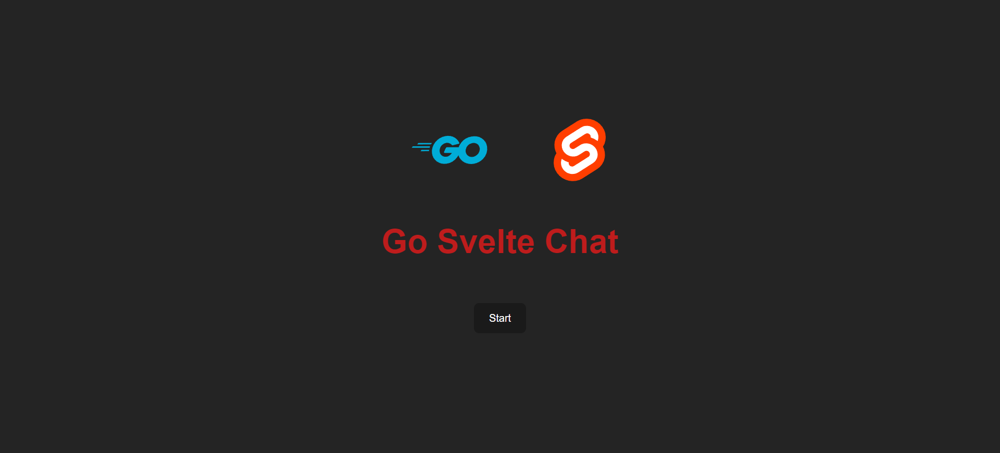
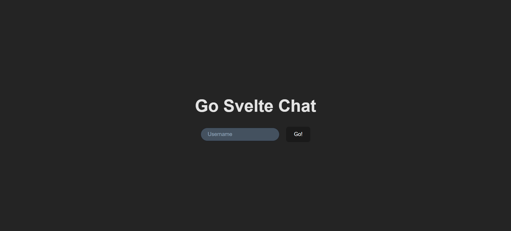
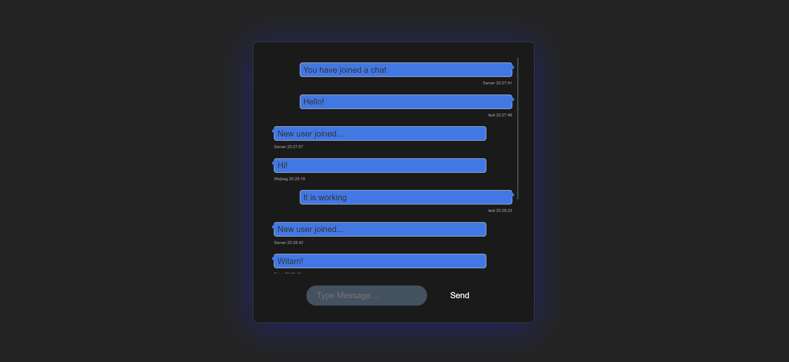
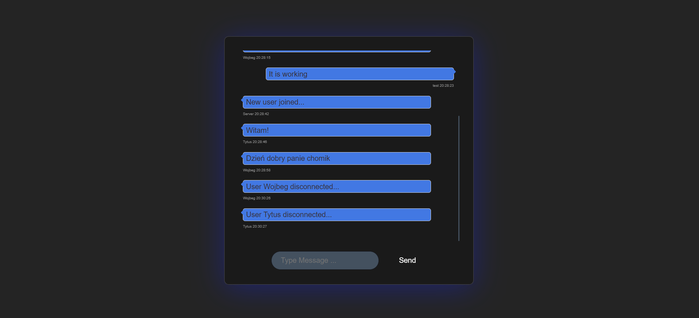
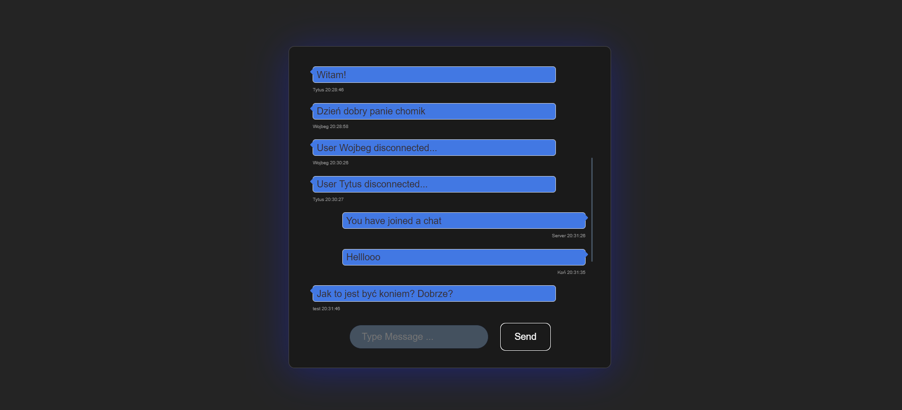
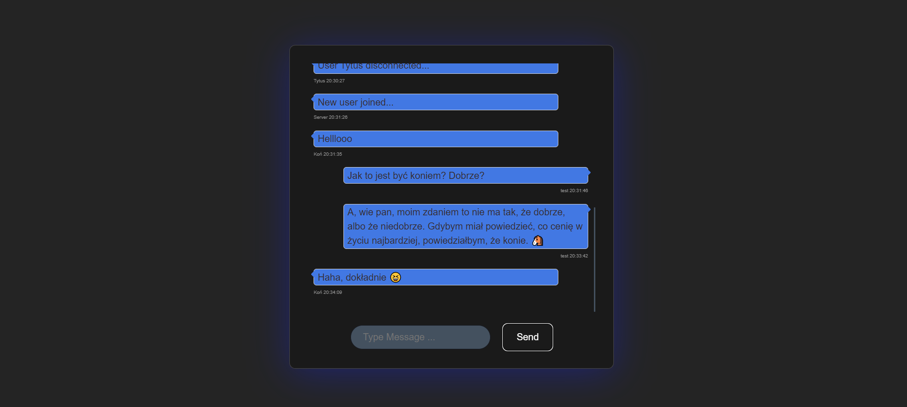
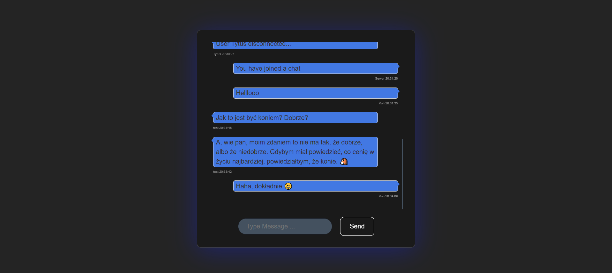
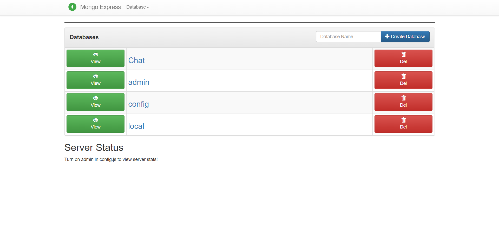
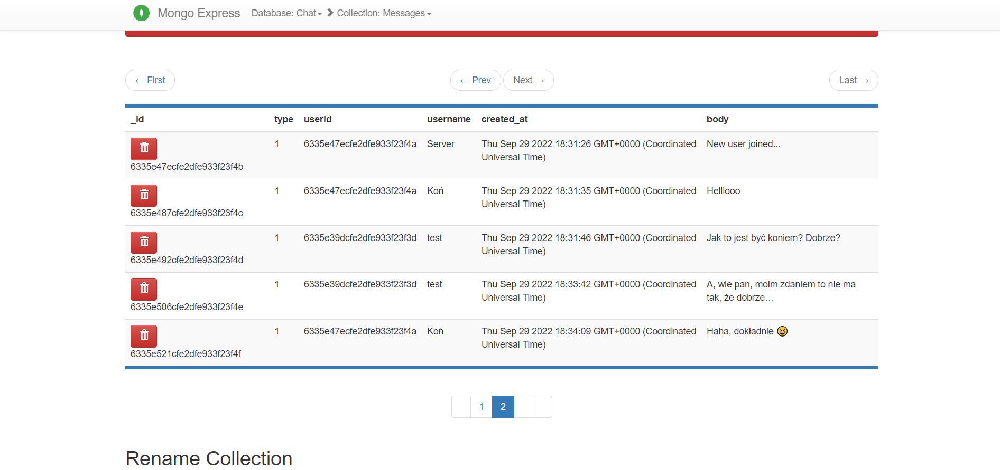

# Go Svelte Chat App

It is a full stack project of the WebSocket chat application.  For backend I used <b>Go, Gorilla WebSocket, MongoDB.</b>  <b>Svelte</b> was used for the frontend (it was my first project built with it). 
The user enters his nickname and joins the chat. The user gets the chat history. Other users are notified about the new user.  

## How to run it:
To run the application, you must have the <b>Docker</b> installed and turned on. Then download this project. You can delete the Illustrations folder, it was only used on gitchub for presentation purposes and it is not needed for the program to run. Then open the folder in the command prompt and enter the command: 
<b>docker compose build<b>   
and after it finishes downloading: 
<b>docker compose up</b>  
To open the application, open the browser and enter the address:  
<b>http://localhost:5173/</b>   
Additionally, you can manage the database using Mongo Express, for this you need to open the browser with the address:  
<b>http://localhost:8081/</b>   

## Table of contents:
* [Technologies](#technologies)
* [Illustrations](#illustrations)

## Technologies
Project is created with: 
Backend:
* Go
* Gorilla Mux WebSocket
* MongoDB
* Mongo Express

Frontend:
* Svelte

## Illustrations

 
 
 
 
 
 
 
 
 

